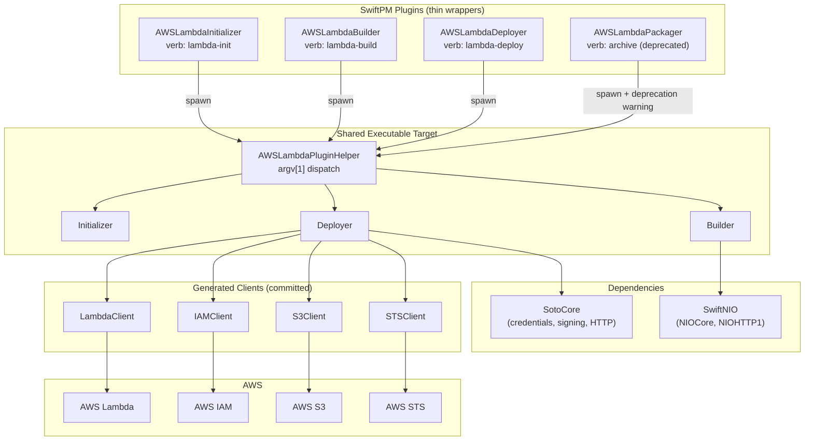
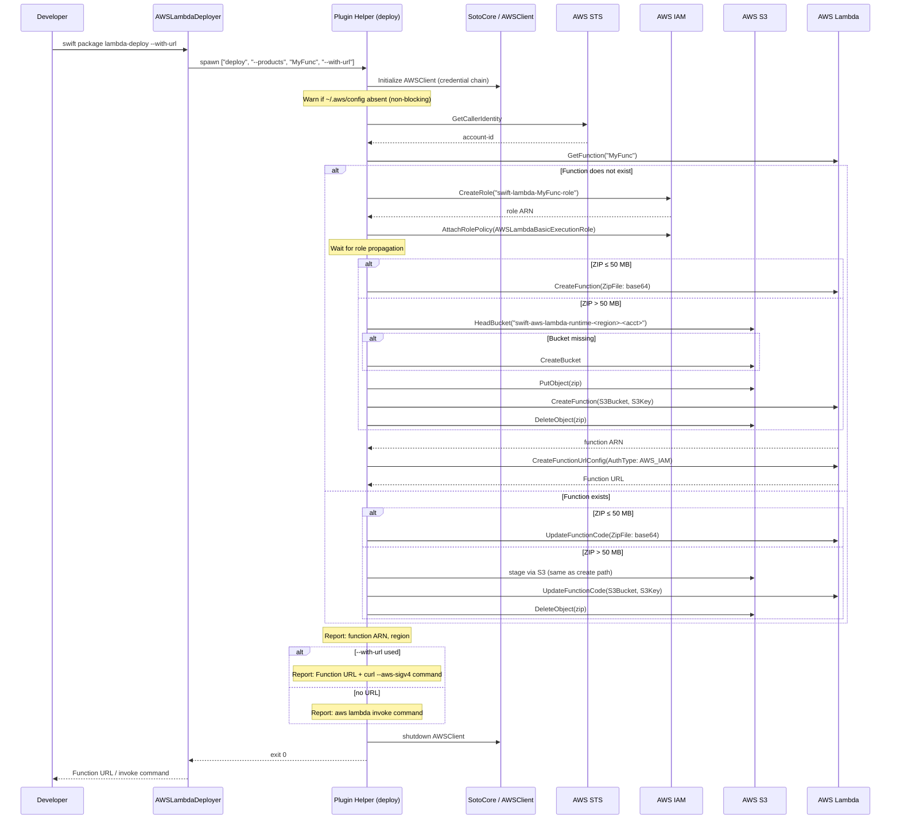

# Design Document: Lambda V2 Plugins

## Overview

This design covers the v4 plugin system for `swift-aws-lambda-runtime`, delivering three SwiftPM command plugins (`lambda-init`, `lambda-build`, `lambda-deploy`) and a legacy `archive` passthrough. All functional logic lives in a single shared executable target (`AWSLambdaPluginHelper`) that dispatches to `Initializer`, `Builder`, or `Deployer` based on the first argument. The deploy command is the primary new implementation, leveraging Soto Core for AWS credential management, SigV4 signing, and HTTP transport, with generated service clients (Lambda, IAM, S3, STS) committed to the repository.

Key design changes from the current implementation:
- Default base image moves from `amazonlinux2` to `amazonlinux2023`
- The blanket AL2 deprecation warning is removed; an informational warning is emitted only when AL2 is explicitly chosen
- `--container-cli` is replaced by a unified `--cross-compile` option accepting `docker`, `container`, `swift-static-sdk`, `custom-sdk`
- Default binary stripping with `-Xlinker -s` and `--no-strip` opt-out
- `--output-directory` is accepted as a deprecated alias for `--output-path`
- Vendored crypto/signer/HTTP code under `Vendored/` is removed in favor of `soto-core`
- The `archive` plugin is uncommented and shares sources with `AWSLambdaBuilder`

## Architecture



### Plugin → Helper Communication

Each plugin wrapper:
1. Resolves `PluginContext`-only values (tool paths, package ID/name/directory, products, configuration)
2. Spawns `AWSLambdaPluginHelper` as a subprocess with the command verb as `argv[1]`
3. Checks exit status: non-zero → `Diagnostics.error(...)` + immediate halt

### Helper Dispatch Bug Fix

The current `command(from:)` method has a guard `args.count > 2` which is too strict — the minimum valid invocation is `[binary_path, command]` (count == 2). The fix changes the guard to `args.count > 1` and reads `args[1]` for the command name. The remaining arguments (`Array(args.dropFirst(2))`) are passed to the subcommand handler.

## Components and Interfaces

### 1. Plugin Wrappers

#### AWSLambdaInitializer (`Plugins/AWSLambdaInitializer/Plugin.swift`)

Thin wrapper. Resolves `--dest-dir` from `context.package.directoryURL`. Passes `["init", "--dest-dir", path] + arguments` to the helper.

#### AWSLambdaBuilder (`Plugins/AWSLambdaBuilder/Plugin.swift`)

Resolves output path, products, configuration, tool paths (docker/zip). Passes `["build", ...resolved, ...user_args]` to the helper.

#### AWSLambdaDeployer (`Plugins/AWSLambdaDeployer/Plugin.swift`)

Resolves products list (to determine executable target name). Passes `["deploy", "--products", targetNames, ...user_args]` to the helper.

#### AWSLambdaPackager (legacy `archive` alias)

Implemented as a **separate plugin directory** (`Plugins/AWSLambdaPackager/Plugin.swift`) because SwiftPM does not allow two plugin targets to share the same source path (it rejects them with an "overlapping sources" error). The plugin has its own thin `Plugin.swift` that:
1. Emits a deprecation warning via `Diagnostics.warning("'archive' is deprecated. Please use 'swift package lambda-build' instead.")`
2. Spawns the `AWSLambdaPluginHelper` executable with `["build"] + arguments` (same delegation as `AWSLambdaBuilder`)
3. Checks exit status and reports a diagnostic error on failure

This was validated at compile time — `swift package describe` confirms both `archive` (verb) and `lambda-build` (verb) resolve to valid, independent plugins without source overlap.

### 2. Initializer (`Sources/AWSLambdaPluginHelper/lambda-init/`)

**Existing implementation preserved.** Files: `Initializer.swift`, `Template.swift`.

Behavior: Writes `Default_Template` or `URL_Template` (when `--with-url`) to `Sources/main.swift` in the destination directory.

No changes required — current implementation satisfies all Requirement 1 criteria.

### 3. Builder (`Sources/AWSLambdaPluginHelper/lambda-build/`)

**Existing implementation preserved with minimal modifications.**

#### Changes Required

| Change | Requirement | Description |
|--------|------------|-------------|
| Default image | 6.1 | `baseDockerImage` default: `"swift:\(version)-amazonlinux2023"` (was `amazonlinux2`) |
| Remove blanket warning | 6.2 | Remove the unconditional `displayDeprecationWarning()` call for all AL2 scenarios |
| AL2 informational warning | 6.3 | Emit a shorter informational warning ONLY when `--base-docker-image` explicitly contains `amazonlinux2` (not `amazonlinux2023`) |
| Strip by default | 2.5 | Add `-Xlinker -s` to both native and Docker build commands |
| `--no-strip` opt-out | 2.6 | When flag present, omit the strip linker flags |
| Unified `--cross-compile` | 2.7 | Replace `--container-cli` with `--cross-compile` accepting `docker\|container\|swift-static-sdk\|custom-sdk` |
| Unsupported methods | 2.14 | `swift-static-sdk`/`custom-sdk` → error with SDK_Installation_Guide link |
| `--output-directory` alias | 7.5/7.6 | Accept as deprecated alias for `--output-path` |
| Container CLI validation | 2.11/2.12 | Check CLI exists; if not → error with download page URL |

#### BuilderConfiguration Changes

```swift
// New cross-compile enum replaces ContainerCLI
enum CrossCompileMethod: String {
    case docker
    case container
    case swiftStaticSdk = "swift-static-sdk"
    case customSdk = "custom-sdk"
}

// In BuilderConfiguration.init:
// 1. Extract --cross-compile (default: "docker")
// 2. Extract --no-strip flag
// 3. Extract --output-directory as alias for --output-path
// 4. Default baseDockerImage → "swift:<version>-amazonlinux2023"
```

### 4. Deployer (`Sources/AWSLambdaPluginHelper/lambda-deploy/`)

**New implementation.** The existing stub is replaced.

#### DeployerConfiguration

```swift
struct DeployerConfiguration {
    let help: Bool
    let verboseLogging: Bool
    let withURL: Bool
    let delete: Bool
    let region: String?           // nil → resolved by Soto
    let iamRole: String?          // nil → create new role
    let inputDirectory: URL?      // nil → default build output path
    let architecture: Architecture // .host by default
    let products: [String]        // from plugin wrapper

    enum Architecture: String {
        case x64, arm64
        static var host: Architecture {
            #if arch(x86_64)
            return .x64
            #else
            return .arm64
            #endif
        }
    }
}
```

#### Deploy Orchestration

```swift
struct Deployer {
    func deploy(arguments: [String]) async throws {
        let config = try DeployerConfiguration(arguments: arguments)
        if config.help { displayHelpMessage(); return }

        // 1. Initialize Soto AWSClient (credential provider chain)
        // 2. Warn if ~/.aws/config missing (non-blocking)
        // 3. Resolve account ID via STS GetCallerIdentity
        // 4. Determine function name from product/target
        // 5. Check if function exists (GetFunction)
        // 6. If --delete: teardown and return
        // 7. Ensure IAM role exists
        // 8. Upload code (direct or via S3 staging)
        // 9. Create or update function
        // 10. If --with-url: configure Function URL
        // 11. Report deployment success:
        //     - Function ARN and region
        //     - If --with-url: Function URL + ready-to-use curl --aws-sigv4 command
        //     - If no URL: ready-to-use aws lambda invoke command
        // 12. Shutdown AWSClient
    }
}
```

### 5. Generated AWS Service Clients

Located at: `Sources/AWSLambdaPluginHelper/GeneratedClients/`

Structure:
```
GeneratedClients/
├── Lambda/
│   ├── LambdaClient.swift
│   ├── LambdaShapes.swift
│   └── LambdaErrors.swift
├── IAM/
│   ├── IAMClient.swift
│   ├── IAMShapes.swift
│   └── IAMErrors.swift
├── S3/
│   ├── S3Client.swift
│   ├── S3Shapes.swift
│   └── S3Errors.swift
└── STS/
    ├── STSClient.swift
    ├── STSShapes.swift
    └── STSErrors.swift
```

Each client is a lightweight struct wrapping `AWSClient` from SotoCore:

```swift
struct LambdaClient {
    let client: AWSClient
    let region: Region

    func getFunction(_ input: GetFunctionRequest) async throws -> GetFunctionResponse
    func createFunction(_ input: CreateFunctionRequest) async throws -> CreateFunctionResponse
    func updateFunctionCode(_ input: UpdateFunctionCodeRequest) async throws -> UpdateFunctionCodeResponse
    func deleteFunction(_ input: DeleteFunctionRequest) async throws
    func createFunctionUrlConfig(_ input: CreateFunctionUrlConfigRequest) async throws -> CreateFunctionUrlConfigResponse
    func deleteFunctionUrlConfig(_ input: DeleteFunctionUrlConfigRequest) async throws
    func addPermission(_ input: AddPermissionRequest) async throws -> AddPermissionResponse
    func removePermission(_ input: RemovePermissionRequest) async throws
}
```

### 6. Generation Script

Located at: `scripts/generate-aws-clients.sh`

One-time, maintainer-run script that:
1. Clones Soto Code Generator
2. Downloads AWS service model JSON files for Lambda, IAM, S3, STS
3. Runs the generator with a config specifying only needed operations
4. Copies output to `Sources/AWSLambdaPluginHelper/GeneratedClients/`

The script is NOT part of the build. If generated files are missing, the build fails with a compile error.

## Data Models

### Deploy State Machine

```swift
enum DeploymentAction {
    case create(CreateFunctionRequest)
    case update(UpdateFunctionCodeRequest)
    case delete(functionName: String)
}

struct DeploymentContext {
    let accountId: String
    let region: Region
    let functionName: String
    let architecture: DeployerConfiguration.Architecture
    let zipArchiveURL: URL
    let zipArchiveSize: Int64
    let iamRoleARN: String
    let action: DeploymentAction
}
```

### Bucket Name Construction

```swift
/// Constructs the deployment bucket name per the naming convention.
/// Format: `swift-aws-lambda-runtime-<region>-<account>`
static func deploymentBucketName(region: String, accountId: String) -> String {
    "swift-aws-lambda-runtime-\(region)-\(accountId)"
}
```

### Archive Size Threshold

```swift
/// AWS Lambda direct upload limit (50 MB compressed).
static let directUploadLimit: Int64 = 50 * 1024 * 1024
```

### Cross-Compile Configuration

```swift
enum CrossCompileMethod: String, CustomStringConvertible {
    case docker
    case container
    case swiftStaticSdk = "swift-static-sdk"
    case customSdk = "custom-sdk"

    var isSupported: Bool {
        switch self {
        case .docker, .container: return true
        case .swiftStaticSdk, .customSdk: return false
        }
    }

    var description: String { rawValue }
}
```

## Deploy Orchestration Sequence



## Package.swift Changes

```swift
// Add soto-core dependency
dependencies: [
    .package(url: "https://github.com/apple/swift-nio.git", from: "2.99.0"),
    .package(url: "https://github.com/apple/swift-log.git", from: "1.12.0"),
    .package(url: "https://github.com/apple/swift-collections.git", from: "1.5.0"),
    .package(url: "https://github.com/swift-server/swift-service-lifecycle.git", from: "2.11.0"),
    .package(url: "https://github.com/soto-project/soto-core.git", from: "7.0.0"),  // NEW
],

// Update AWSLambdaPluginHelper dependencies
.executableTarget(
    name: "AWSLambdaPluginHelper",
    dependencies: [
        .product(name: "NIOHTTP1", package: "swift-nio"),
        .product(name: "NIOCore", package: "swift-nio"),
        .product(name: "SotoCore", package: "soto-core"),  // NEW
    ],
    swiftSettings: defaultSwiftSettings
),

// Uncomment archive alias plugin (separate directory, NOT shared path)
// SwiftPM rejects shared-path with "overlapping sources" error.
// Instead: Plugins/AWSLambdaPackager/Plugin.swift with its own thin wrapper.
.plugin(
    name: "AWSLambdaPackager",
    capability: .command(
        intent: .custom(
            verb: "archive",
            description:
                "Archive the Lambda binary and prepare it for uploading to AWS. (Deprecated: use lambda-build instead)"
        ),
        permissions: [
            .allowNetworkConnections(
                scope: .docker,
                reason: "This plugin uses Docker to create the AWS Lambda ZIP package."
            )
        ]
    ),
    dependencies: [
        .target(name: "AWSLambdaPluginHelper")
    ]
    // No `path:` — uses default Plugins/AWSLambdaPackager/ directory
),
```

## Correctness Properties

*A property is a characteristic or behavior that should hold true across all valid executions of a system — essentially, a formal statement about what the system should do. Properties serve as the bridge between human-readable specifications and machine-verifiable correctness guarantees.*

### Property 1: ZIP archive always contains bootstrap binary

*For any* compiled product with any valid name, when the packaging step produces a ZIP archive, the archive SHALL contain a file named `bootstrap` (the renamed binary) regardless of the original product name.

**Validates: Requirements 2.3**

### Property 2: Deprecated option alias equivalence

*For any* path value supplied via `--output-directory`, the resulting `BuilderConfiguration.outputDirectory` SHALL be identical to the value produced when the same path is supplied via `--output-path`.

**Validates: Requirements 7.5, 7.6**

### Property 3: Cross-compile method parsing round-trip

*For any* valid `CrossCompileMethod` enum case, converting the case to its `rawValue` string and parsing it back SHALL produce the original enum case.

**Validates: Requirements 2.7**

### Property 4: Mutual exclusion of --swift-version and --base-docker-image

*For any* non-empty swift-version string and any non-empty base-docker-image string supplied together, argument parsing SHALL throw a mutually-exclusive-argument error.

**Validates: Requirements 2.17**

### Property 5: Deployment bucket name construction

*For any* valid AWS region string and any valid 12-digit account ID, `deploymentBucketName(region:accountId:)` SHALL produce the string `"swift-aws-lambda-runtime-<region>-<accountId>"` and the result SHALL always be a valid S3 bucket name (lowercase, no uppercase, 3-63 chars).

**Validates: Requirements 3.17, 3.18**

### Property 6: Archive size determines upload strategy

*For any* ZIP archive size, if the size is ≤ `directUploadLimit` (50 MB) then the deploy logic SHALL choose direct upload; if the size is > `directUploadLimit` then it SHALL choose S3 staging.

**Validates: Requirements 3.15, 3.19**

### Property 7: Non-zero helper exit causes plugin wrapper halt

*For any* plugin wrapper (Initializer, Builder, Deployer) and any non-zero exit code from the helper subprocess, the wrapper SHALL emit a `Diagnostics.error` and SHALL NOT continue with further work.

**Validates: Requirements 5.6**

### Property 8: AL2 warning emitted only for explicit AL2 image selection

*For any* base-docker-image value containing "amazonlinux2" but NOT "amazonlinux2023", the builder SHALL emit the AL2 informational deprecation warning. *For any* base-docker-image value containing "amazonlinux2023" or when using the default image, the builder SHALL NOT emit the AL2 warning.

**Validates: Requirements 6.2, 6.3**

### Property 9: Unsupported cross-compile methods report error with link

*For any* cross-compile value in {`swift-static-sdk`, `custom-sdk`}, the builder SHALL report a "not yet supported" error that contains a URL to the SDK_Installation_Guide.

**Validates: Requirements 2.14**

### Property 10: Host architecture default

*For any* host machine architecture (x64 or arm64), when `--architecture` is omitted, the deployer SHALL set the Lambda function architecture to match the host.

**Validates: Requirements 3.13**

## Error Handling

### Error Categories and Responses

| Category | Example | Response |
|----------|---------|----------|
| Argument validation | Mutually exclusive options | Print error, exit non-zero immediately |
| Missing tool | Docker/container CLI not found | Print error with download URL, exit non-zero |
| Unsupported method | `--cross-compile swift-static-sdk` | Print "not yet supported" with SDK guide link, exit non-zero |
| Build failure | Compilation error in container | Stream compiler output, exit non-zero |
| Product not found | Binary missing after build | Print expected path, exit non-zero |
| Credential failure | No AWS credentials resolved | Print descriptive error, exit non-zero |
| AWS API error | CreateFunction returns 4xx/5xx | Print AWS error message and code, exit non-zero |
| File I/O error | Cannot write template | Print OS error description, exit non-zero |
| Non-blocking warning | ~/.aws/config absent | Print informational warning, CONTINUE |
| Non-blocking warning | AL2 image explicitly chosen | Print deprecation notice, CONTINUE with build |

### Error Propagation Strategy

1. **Helper → Plugin**: Non-zero exit code. Plugin reads exit status and emits `Diagnostics.error(...)`.
2. **Within Helper**: Swift `throw` with typed errors (`BuilderErrors`, `DeployerErrors`). Top-level `main()` catches and prints, then calls `exit(1)`.
3. **AWS errors**: Soto throws `AWSClientError` or `AWSResponseError`; the deployer catches, formats the message (including request ID when available), and re-throws as `DeployerErrors.awsError(...)`.

### Deployer-Specific Errors

```swift
enum DeployerErrors: Error, CustomStringConvertible {
    case credentialResolutionFailed(String)
    case awsAPIError(service: String, operation: String, message: String)
    case archiveNotFound(URL)
    case invalidArchitecture(String)
    case functionURLCreationFailed(String)
    case iamRoleCreationFailed(String)
    case missingProduct
}
```

## Testing Strategy

### Unit Tests (Swift Testing framework)

Located at: `Tests/AWSLambdaPluginHelperTests/`

Test categories:
- **Argument parsing**: Verify `BuilderConfiguration` and `DeployerConfiguration` parse all options correctly, handle defaults, detect mutual exclusions, and map deprecated aliases
- **Cross-compile method parsing**: Round-trip enum ↔ string, invalid values
- **Bucket name construction**: Various region/account combinations, validate S3 naming rules
- **Archive size threshold**: Boundary values (exactly 50MB, 50MB+1, 0)
- **Host architecture detection**: Verify correct enum value on current platform
- **AL2 image detection**: Various image strings, boundary between AL2 and AL2023

### Property-Based Tests (SwiftCheck or swift-testing parameterized)

Configuration: Minimum 100 iterations per property test.

Each property test references its design document property via tag comment:
```swift
// Feature: lambda-v2-plugins, Property 2: Deprecated option alias equivalence
@Test(arguments: samplePaths)
func deprecatedAliasEquivalence(path: String) { ... }
```

Property-based testing library: Use Swift Testing's `@Test(arguments:)` with generated input collections for parameterized testing, since the input domains are finite and well-bounded (path strings, enum cases, size values).

### End-to-End Test (Shell Script)

Located at: `scripts/integration-test.sh`

Flow:
```bash
#!/bin/bash
set -euo pipefail

FUNCTION_NAME="swift-lambda-e2e-test-$(date +%s)"
CLEANUP_NEEDED=false

cleanup() {
    if [ "$CLEANUP_NEEDED" = true ]; then
        swift package lambda-deploy --delete --products "$FUNCTION_NAME" || true
    fi
}
trap cleanup EXIT

# 1. Create temp directory, init swift package
# 2. swift package lambda-init --with-url
# 3. swift package --allow-network-connections docker lambda-build
# 4. swift package --allow-network-connections all lambda-deploy --with-url
CLEANUP_NEEDED=true
# 5. Extract Function URL from output
# 6. curl --aws-sigv4 "aws:amz:<region>:lambda" \
#         --user "$AWS_ACCESS_KEY_ID:$AWS_SECRET_ACCESS_KEY" \
#         -H "x-amz-security-token: $AWS_SESSION_TOKEN" \
#         "$FUNCTION_URL?name=World"
# 7. Verify response contains expected message
# 8. swift package lambda-deploy --delete
CLEANUP_NEEDED=false
```

Key aspects:
- Uses `trap cleanup EXIT` to guarantee resource cleanup on failure (Req 9.10)
- Function URL uses `AWS_IAM` auth, validated via `curl --aws-sigv4` (Req 9.7, 9.8)
- Verifies response body matches expected output (Req 9.6, 9.11)
